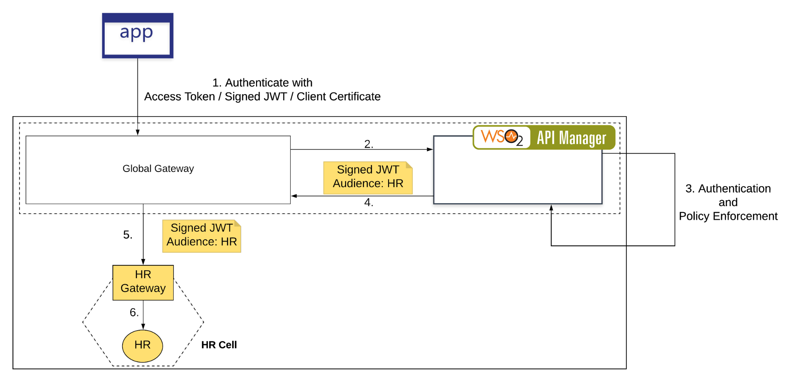
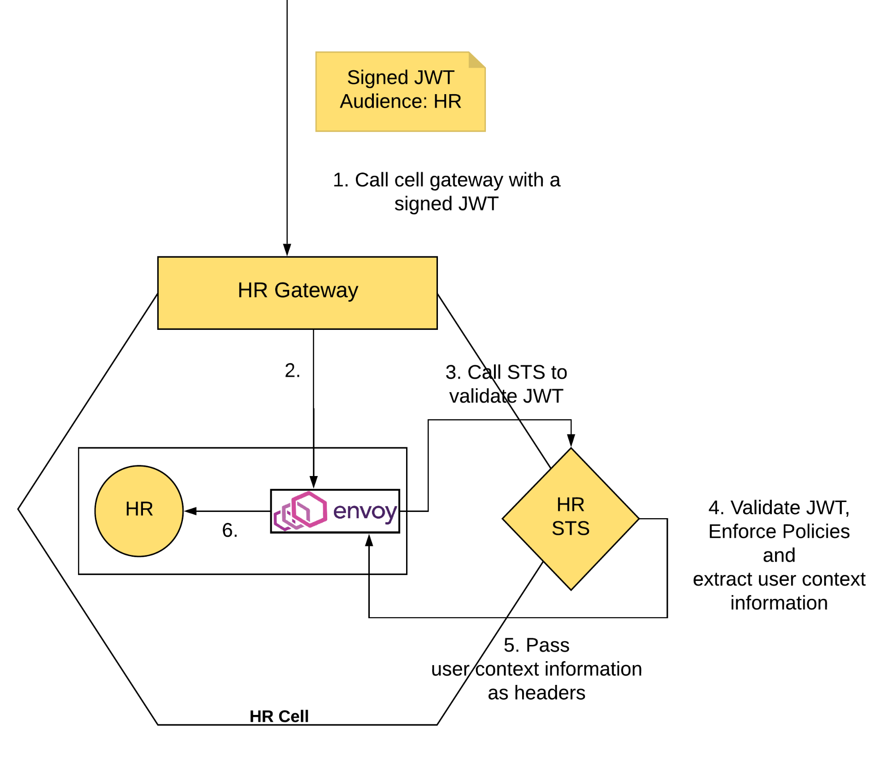
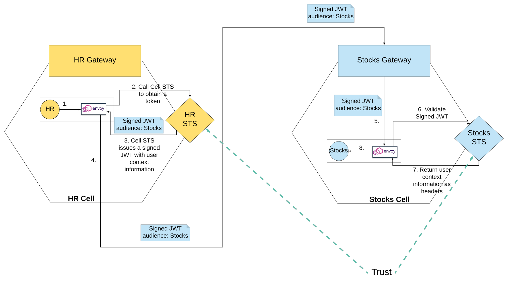

# Mesh Security


  [](https://wso2.org/jenkins/view/cellery/job/cellery/job/mesh-security/)
  [](https://github.com/cellery-io/mesh-security/releases)
  [](https://github.com/cellery-io/mesh-security/releases)
  [](https://github.com/cellery-io/mesh-security/commits/master)
  [](https://opensource.org/licenses/Apache-2.0)
  
Within Cellery, each cell is considered as a unique trust domain. Each of these cells have it's own Secure Token Service (STS) which the workloads can use to communicate in a trusted manner with each other. Not only authentication, but also fine grained authorization requirements are also  can be achieved for inter and intra cell communications. 

### Journey of a request in terms of security.

### Edge Security 

Cellery mesh has an entry point to the data plain which we call as the global gateway. Cell developers publish their global APIs to global gateway which ultimately are be exposed through global gateway. These APIs can be protected or unprotected. In a case if the APIs are protected, the end user will be retrieving an edge token to invoke the API through global gateway.

This token will be an opaque token and end users uses this token to invoke APIs. Upon invoking APIs, global gateway issues a JWT token to the backend service, which is exposed through the cell gateway after validating the edge token. 

<div align="center"></div>


### Cell Security

From this point onwards the request will be flowing through cells and this is the first entry towards a cell. Each data plane component in Cellery has a sidecar attached to it. The requests which reaches components are intercepted by the STS through sidecars.

<div align="center"></div>

### Request Flow


Below sequence diagram elaborates the flow of a request within Cellery mesh while interacting with two cells

<div align="center"></div>

### Inter Cell Communication


<div align="center"></div>

Cells have trust relationship with each other. When a service in one cell invokes a service in another cell, issuer a cell’s STS issues a token addressing the destination cell passing user context obtained through the original edge token. Destination cell validates the token using issuer cells keys. In a case key is not cached, it will call the JWKS of the issuer cell and retrieve keys.  

### Configuring Cell STS.

| Configuration Element     | Description                                           |
| ------------------------- | ----------------------------------------------------- |
| globalJWKS                | Global JWKS endpoint which is the APIM JWKS endpoint  |
| enableSignatureValidation | Enable / Disable signature validation of tokens       |
| enableIssuerValidation    | Enable / Disable issuer validation of tokens.         |
| enableAudienceValidation  | Enable / Disable audience validation of tokens        |
| enableAuthorization       | Enable / Disable authorization evaluations            |
| OPAQueryPrefix            | OPA query prefix. Default one is data/cellery/io .(This is the package you are writing the policy).|    |


### Policy based access control.

An Open Policy Agent (OPA) instance is running alongside with each STS. The default Cellery authorization mechanism is based on OPA quries. 

#### Sample

To start with you can deploy the review [sample](https://github.com/cellery-io/sdk/tree/master/samples/product-review). When you invoke the service, you will get the expected results as the response. 

In order to apply a policy, edit the policy by editing the configmap customer-products-policy. 

1) Open the policy configured for customer products cell. 
```
kubectl edit configmaps kubectl edit configmaps customer-products--sts-policy
```
2) Add the blow policy instead of default policy 

```
 package cellery.io
   customer_products__categories_service_allow = false

   customer_products__categories_service_allow {	
     input.source.cellName="NonExistingCell"
   }
```
  		
  This policy denies requests to customer-products--categories-service if the source cell name is not equal to **“NonExistingCell”**. After configuring this policy, wait for few seconds to get this deployed in OPA. (you can observe the logs of OPA container of customer-products-sts pod). Invoke the service. In the response, below error can be observed as a part of the response.

```
"category": {
        "id": "3",
        "error": "category service is currently unavailable"
      },
```

The customer--products--categories-service denies the request since the source cell is not **"NonExistingCell"** . Reivews cell failed to retrieve response from this service since reivews cell is not allowed to talk to customer-products cell. 

Format of the input json to OPA server can be found in [here](./resources/input.json)

**Note : The rego poclicies should be written by replacing the "-" in your serivce name with "_" since - is a preseved 
character in rego. Also the service name should be followed by a "_allow" in rego rule**

## Repo Structure
 
 Components comprise of cell and global components whereas docker directory contains docker files for building each 
 components. Below is the source tree of mesh-security
        
        
        ├── components
        │   ├── cell
        │   │   └── cell sts (Cell STS server)
        │   ├── global
        │   │   ├──extensions used in global APIM (JWT issuer to backed)
        │   │   ├──token endpoint(Customized token endpoint for retrieving tokens for testing purposes)
        │   │   └──token endpoint core (core logic of customized token endpoint in global plane)
        │   └── orbit (gogoproto orbit which is used as a dependency to cell STS)
        └── docker
            └── sts docker (Docker file to build Cell STS image)

## Contribute to Cellery Mesh Security

The Cellery Team is pleased to welcome all contributors willing to join with us in our journey.

### Build from Source

#### Prerequisites 

To get started with building Cellery Mesh Security, the following are required.

* Docker
* Git
* JDK 1.8 or higher
* Maven
* GNU Make 4.1+
		
#### Steps
Clone mesh-security using below command.
```
git clone https://github.com/cellery-io/mesh-security.git
```
Build the repo either using make file.
```
make build-all
```
### Issue Management

Cellery Mesh Security issue management is mainly handled through GitHub Issues. Please feel free to open an issue about any question, bug report or feature request that you have in mind. (If you are unclear about where your issue should belong to, you can create it in Cellery SDK.)

We also welcome any external contributors who are willing to contribute. You can join a conversation in any existing issue and even send PRs to contribute. However, we suggest to start by joining into the conversations and learning about Cellery Mesh Security as the first step.

Each issue we track has a variety of metadata which you can select with labels:

* Type: This represents the kind of the reported issues such as Bug, New Feature, Improvement, etc. 
* Priority: This represents the importance of the issue, and it can be scaled from High to Normal.
* Severity: This represents the impact of the issue in your current system. If the issue is blocking your system, and it’s having an catastrophic effect, then you can mark is ‘Blocker’. The ‘Blocker’ issues are given high priority as well when we are resolving the issues. 

Additional to the information provided above, the issue template added to the repository will guide you to describe the issue in detail therefore we can analyze and work on the resolution towards it. We appreciate to fill the fields mostly as possible when you are creating the issue. We will evaluate issues, and based on the label provided details and labels, and will allocate to the Milestones.
